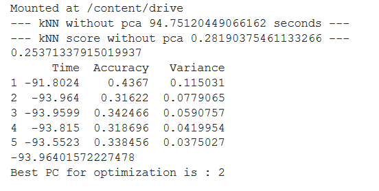

# pcaOptimize
Wrapper function to find the best number of PCs for the optimal runtime and a loss no greater than maxLoss specified by the user.
And compare the runtime to kNN without pca and kNN with pca

## Usage ##

An example of it being used can be found in [the ipynb](pcaOptimize.ipynb) where the function call looks like this:
```
pcaOptimize(X,y,rows,k,pcs,maxLoss)
```

## Features ##
**X** and **y** are the features and target values respectively\
**rows** is the number of rows to run the optimization on\
**k** is the number of *nearest-neighbors* to run kNN on\
**pcs** is the principal components to run the optimizer on\
**maxLoss** is the maximum loss we can take as compared to the base kNN function without pca

## Results ##
For a generic function call the results were as follows
```
pcaOptimize(X,Y,200, 12, 5, 1.1)
```

<p align="center">
  
</p>
